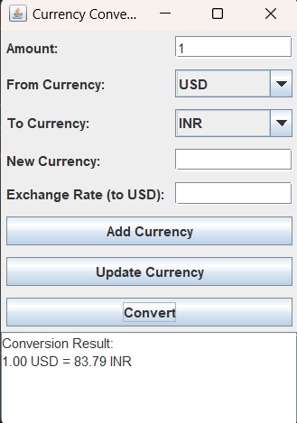

# CURRENCY-EXCHANGER

# Currency Converter Application

## Overview

This Currency Converter application is a simple, easy-to-use tool developed using Java and Swing for real-time currency exchange calculations. It provides a friendly interface and operates in offline mode, ensuring that no user data is required or stored.

## Features

- **User-Friendly Interface**: Simple and intuitive interface for ease of use.
- **Offline Mode**: No internet connection required for basic functionality.
- **Dynamic Currency Management**: Add, update, and delete currencies and their exchange rates.
- **Initial Data Setup**: Users need to input initial currency values as no data is available at the start.
- **Data Persistence**: Currency data is saved and retained across sessions.
- **Currency Rate Upgradability**: Users can update currency rates to stay current with exchange fluctuations.
- **No User Data Required**: Ensures user privacy as no personal data is needed.

## Getting Started

### Installation

 **Run the Application**

   Locate the `Currency.exe` file in the repository and run it.

### Adding Initial Currencies

When starting the application for the first time, no currency data will be present. Follow these steps to add initial currencies:

1. **Open the Application**

   Launch the application by running the `Currency.exe` file.

2. **Add Currencies**

   - Click on the “Add Currency” button.
   - Enter the currency name (e.g., USD, INR) and its exchange rate compared to USD (as the base currency).
   - Click “Save” to add the currency.

   Repeat the process to add more currencies as needed.

### Usage

1. **Select Currencies**

   - Choose the base currency and the target currency from the dropdown lists.
   - Enter the amount to be converted.

2. **Perform Conversion**

   - Click the “Convert” button to see the conversion result.
   - The result will display in the format: `1 USD = 83.79 INR`.

3. **Manage Currencies**

   - **Update Currency**: Select a currency and enter the new exchange rate.
   - **Delete Currency**: Select a currency and click the “Delete” button to remove it.

### Updating Exchange Rates

To update the exchange rates:

1. **Open the Application**

   Launch the `Currency.exe` file.

2. **Select Currency**

   - Choose the currency to update from the from currency dropdown list.

3. **Update Rate**

   - Enter the new exchange rate.
   - Click the “Update” button to save changes.
  

# Here are five future scope points for your Currency Converter project:

1. **Mobile Application Development:** We plan to develop native mobile applications for both Android and iOS platforms to make the currency converter accessible on mobile devices, providing users with real-time currency conversion on the go.

2. **Automated Exchange Rate Updates:** Integrate an automated system for updating exchange rates using reliable financial data APIs, ensuring that the application always provides the most current conversion rates without manual input.

3. **Enhanced User Interface:** Improve the user interface to be more intuitive and visually appealing, with features such as dark mode, customizable themes, and enhanced navigation for a better user experience.

4. **Multi-language Support:** Introduce multi-language support to cater to a global audience, allowing users to use the application in their preferred language.

5. **Advanced Features:** Add advanced features like historical exchange rate charts, currency conversion notifications, and financial news updates to make the application more comprehensive and useful for users.

